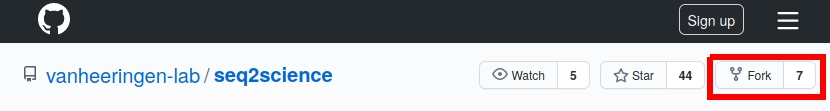
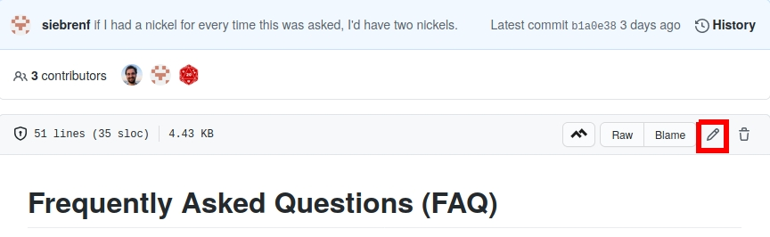
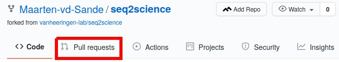
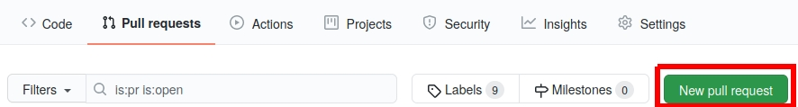
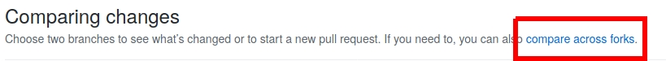
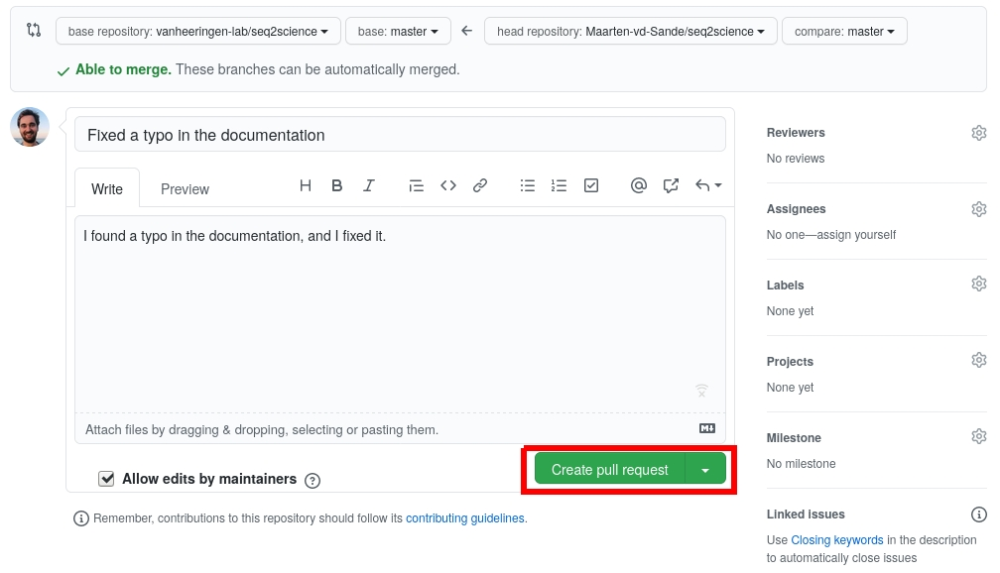

# Contributing to seq2science

**Thanks for taking the time to contribute!!**

The following is a set of guidelines and hints how to get started with contributing to seq2science.

## I dont want to read this whole thing i just have a question

Questions can be asked on the github issues page. Make sure to check if the question has been asked before in old issues and check the Frequently Asked Section (FAQ) in the docs if it's there.

## Reporting bugs
Bug reports can be made by making an issue on the [github issues page](https://github.com/vanheeringen-lab/seq2science/issues).

## Code/documentation

Outside of bugs/docs fixes, before you make a code contribution make sure to check in with us (the developers) if we are willing to support the contribution by making an issue first.

For an example on how to add to the documentation, see the example PR below. 

### Gitflow

We (try to) use the [gitflow](https://nvie.com/posts/a-successful-git-branching-model/) model to organise our parallel development. When making a PR, make sure to start from the develop branch and make a PR to develop branch.

### Project design

Seq2science has grown to be a rather large project, with a complicated code structure. Before contributing to seq2science it is important to be up-to-date with the file and logic structure. 

#### Documentation

The documentation can always be improved, and contributions are highly appreciated! Apart from the auto-generated part of the docs, all the stuff relevant to the documentation is in the `docs` folder in the root. The markdown files that make up the documentation are in `docs/content`.

#### tests

Seq2science runs tests on a Jenkins server after each push. Everything related to the tests can be found in the `tests` folder in the root.

#### source code

The "source code" is split across multiple folders in the `seq2science` folder.

#### envs

In the `seq2science/envs` folder all the environments for each rule is stored. When adding new rules make sure to add a new environment here. 

#### imgs

These images are being shipped with seq2science. At the time of writing the only image that is in this folder is a Radboud University logo that is added to the MultiQC report.

#### rules

In `seq2science/rules` is where the magic happens. Practically all rules and logic is in this folder. Rules are split across 'logical' topics, such as alignment, peak calling or downloading. A workflow can thus easily include a couple of these files and link different topics.

All the files that start with `configuration_` actually do not contain any rules. These files are used to parse the samples.tsv and config.yaml. These files are unfortunately pretty complex, but any time something big is changed, you probably have to change some stuff here.

#### schemas

This folder contains multple schemas. It contains schemas to parse and extend the `config.yaml` at the start of the run, but it also contains e.g. the schema for the MultiQC report.

#### scripts

`seq2science/scripts` contains all the scripts that rules use to.

#### workflows

In `seq2science/workflows` are the different workflows. Each workflow consists of a Snakefile, which defines what the total output is, which schemas are needed, and which rules. In this folder is also an example samples.tsv and config.yaml, which is copied when using `seq2science init`.

#### util.py

Useful utility functions are deposited in this file.

#### important global variables

There are a couple important global variables

* **config**, in config all the configuration stuff is stored. Everything that you fill out in the config.yaml is in here. This is parsed by the relevant schemas in `seq2science/schemas` , and some extra parsing is done in `seq2science/rules/configuration_`. 
* **samples**, samples is the samples.tsv as a pandas dataframe, after some parsing done in `seq2science/rules/configuration_`. 
* **sampledict**, sampledict contains some information per sample that is not present in the samples.tsv file. In here is stored whether samples are SINGLE-end or PAIRED-end, and their corresponding SRR numbers.
* **breps & treps**, breps and treps are variables that represent the technical and biological replicates. If you want to iterate over eiher of the technical replicates or biological replicates, or check what a sample belongs to, it is probably easiest to use these.
* **global wildcard constraints**, seq2science sets global wildcard constraints in `seq2science/rules/configuration_generic.smk`. Make sure to adhere to the naming convention of samples and assembly. 
* **sequencing_protocol** contains the current workflow, spelled out properly (e.g. "ChIP-seq").

### Example PR

If something in the documentation is wrong or unclear, please feel free to change it, no matter how small. Veteran FOSS (Free and Open Source Software) contributors already know how the process of suggesting changes to a project work (called a PR/Pull Request). However for people new to FOSS this relatively easy process can be a daunting task. Here we give an example of how to make changes to the documentation and propose them to us (the maintainers).

1. Make a github account
2. Make a "fork" of the repository

3. Now navigate on your "fork" to the documentation you want to change, for instance you could go to`docs/content/FAQ.md` to add a new question (and answer!).
4. make some changes

5. "commit" your changes to the `master` branch`.
6. Make a Pull Request (PR). 
    * 
    * 
    * 
    * 
7. Wait for us to accept it..
8. See the changed docs online!
